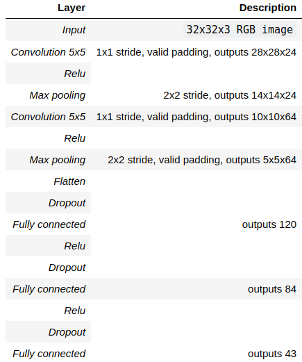
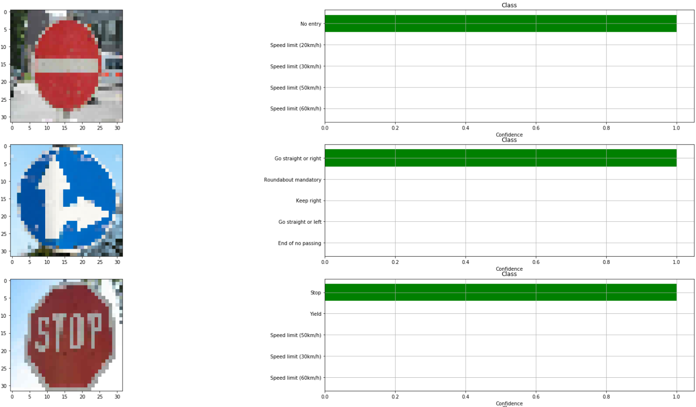

# **Traffic Sign Recognition** 
### Self driving cars use a lot of algorithms to detect the world. This project is one of the input that I consider that is super important in the street. Recognize traffic signs! Probably, this could be save your life ! :)
---

**Build a Traffic Sign Recognition Project**

My goal is provide a clear code for the community. Feel free to run the code, test it and create another functions that help to get better results.

You're reading it! and here is a link to my [project code](https://github.com/udacity/CarND-Traffic-Sign-Classifier-Project/blob/master/Traffic_Sign_Classifier.ipynb)

The goals / steps of this project are the following:
* Load the data set
* Explore, summarize and visualize the data set
* Design, train and test a model architecture
* Use the model to make predictions on new images
* Analyze the softmax probabilities of the new images
* Summarize the results with a written report

### Dataset Exploration

- *Dataset Summary* - 

    The pickled data is a dictionary with 4 key/value pairs:

- - `'features'` is a 4D array containing raw pixel data of the traffic sign images, (num examples, width, height, channels).
- - `'labels'` is a 1D array containing the label/class id of the traffic sign. The file `signnames.csv` contains id -> name mappings for each id.
- -  `'sizes'` is a list containing tuples, (width, height) representing the original width and height the image.
- -  `'coords'` is a list containing tuples, (x1, y1, x2, y2) representing coordinates of a bounding box around the sign in the image.

- *Exploratory Visualization*

    Find below the distribution of the data set according to each class. In that chart, we can see that all classes are not equal in number of samples, that means, the neural network could train using over fitting, because there is not enough data to train the model.

     

    For more information, we analyzed the number of training images, validation, testing and some important characteristics of the images that will be helpful in software development.

    | Description                        |   Number    |
    |------------------------------------|:-----------:|
    | Number of training examples        | 34799       |
    | Number of validation examples      | 4410        |
    | Number of testing examples         | 12630       | 
    | Image data shape                   | (32, 32, 3) |
    | Number of classes                  | 43          |
    | Total number of samples in dataset | 51839       |

    On the other hand, you can see aleatory images of the data set, this is just for understand how the images looks like and what is exactly the challenge to solve.

      

Find below the design and the implementation of a deep learning model that learns to ecognize traffic signs. Trained and tested with the [German Traffic Sign Dataset](http://benchmark.ini.rub.de/?section=gtsrb&subsection=dataset)

A solid starting point is use the LeNet-5 implementation shown in the classroom. Basically, I changed the number of class and some layers, but eventually is the same architecture. 

There are various aspects to consider when thinking about this problem:

- - Neural network architecture (is the network over or underfitting?)
- - Play around preprocessing techniques (normalization, rgb to grayscale, etc)
- - Number of examples per label (some have more than others).
- - Generate fake data.

- *Preprocessing*

    Minimally, the image data should be normalized so that the data has mean zero and equal variance. For image data, `(pixel - 128)/ 128` is a quick way to approximately normalize the data and can be used in this project.

    According to the figure shown before, we can see that the data set is not fully balanced, there are classes that do not have enough images to guarantee a good neural network's performance. I am not saying that the neural network will not work, I am stating that if we have more data, we will ensure that the network does not generate 'overfitting' or that it simply learns characteristics of the images without the ability to recognize others.
    In order to solve the problem, there is a chance to extend our data, the name is Data Augmentation can be done.

- *Model Architecture*

      
    
    A validation set can be used to assess how well the model is performing. A low accuracy on the training and validation sets imply underfitting. A high accuracy on the training set but low accuracy on the validation set implies overfitting.

      

      
     

My final model results were:
* training set accuracy of 100%
* validation set accuracy of 98.7%
* test set accuracy of 90.16%

If an iterative approach was chosen:
* What was the first architecture that was tried and why was it chosen?
    
    The solution that I chose was to apply what we saw in the classes. Use a LeNet-5 architecture, because it is recommended to start with something that works quite well and during the process make fine tunning.

* What were some problems with the initial architecture?

    Basically, I found that precision was not sufficient and I investigated with my classmates how I could make changes in the architecture to obtain better results, we found that LeNet is an old architecture compared to modern ones and given that it is limited to find more characteristics.

* How was the architecture adjusted and why was it adjusted? Typical adjustments could include choosing a different model architecture, adding or taking away layers (pooling, dropout, convolution, etc), using an activation function or changing the activation function. One common justification for adjusting an architecture would be due to overfitting or underfitting. A high accuracy on the training set but low accuracy on the validation set indicates over fitting; a low accuracy on both sets indicates under fitting.

    To begin to adjust the architecture of the neural network, I thought about what changes directly impact the extraction of the characteristics of the image and found that by changing the size of the convolutional layer it was a good approach. The decision was not to use Data Augmentation, so, it was decided to use Dropout, to avoid Overfitting.

* Which parameters were tuned? How were they adjusted and why?

The parameters that were adjusted were Learning_Rate, Num_Channels, Batch_size and the number of training Epochs. The following shows how these variables were defined.

| Parameters    | Number |
|---------------|:------:|
| Learning_rate | 0.0005 |
| Num_Channels  | 3      |
| Epochs        | 150    |

With the training result, I found that it was not necessary to use 150 of Epochs since the graph does not increase with more than 38 Epochs. Therefore, the training could be set at 40 Epochs to increase the training time of the neural network.

### Test a Model on New Images

- *Acquiring New Images* 
    
    Find below some new images to test the model.

     

    The model trained had an accuracy of 75%. Find below the description for each image and the classification.

     

     

     

### (Optional) Visualizing the Neural Network (See Step 4 of the Ipython notebook for more details)
#### 1. Discuss the visual output of your trained network's feature maps. What characteristics did the neural network use to make classifications?

  

  

